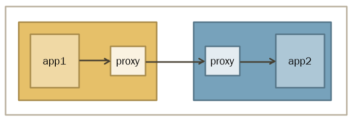

# hcnproxyctl

Host Container Networking Proxy Controller is a high-level library and executable that allows
users to program layer-4 proxy policies on Windows through the [Host Networking Service (HNS)](https://docs.microsoft.com/en-us/windows-server/networking/technologies/hcn/hcn-top).

It is intended to be used as part of a service mesh to redirect all traffic in a given network compartment through a sidecar proxy.



## Traffic redirection on Windows
On Linux, iptables rules are used to intercept and redirect traffic. On Windows, this is achieved using the HNS [L4WfpProxyPolicySetting](https://docs.microsoft.com/en-us/virtualization/api/hcn/hns_schema#l4wfpproxypolicysetting). The `L4WfpProxyPolicySetting` utilizes the [Windows Filtering Platform](https://docs.microsoft.com/en-us/windows/win32/fwp/about-windows-filtering-platform) (WFP) for network traffic filtering and redirection.

For demonstration, here is an example JSON of a `L4WfpProxyPolicySetting` that will ensure all (in/out)bound `TCP` traffic gets redirected to (proxy) ports `9091`/`9191` respectively. unless:
  * The traffic has already been inspected by the network proxy (process launched with user identity [SID S-15-18](https://docs.microsoft.com/en-us/windows/security/identity-protection/access-control/security-identifiers)). This is used to distinguish traffic that has already been redirected and processed by the network proxy. This is required because otherwise traffic originating from the proxy would be forwarded back to the proxy, thereby creating a redirection loop.
    * See `"UserSID"` field below.
  * The traffic has destination IP `"127.0.0.1"`. This is needed to accommodate traffic between other (local) sidecar applications that share the same IP address and port space. 
    * See `"IpAddressExceptions"` field below.
  * The traffic has destination port `"90001"` or `"90002"`. Such exemptions can be useful to accommodate connections to the administrative endpoint of a proxy, as well as account for any other special cases such as health probes, metrics queries, etc.
    * See `"PortExceptions"` field below. 
```JSON
{
    "Type": "L4WFPPROXY",
    "Settings": {
        "InboundProxyPort": "9091",
        "OutboundProxyPort": "9191",
        "FilterTuple": {
            "Protocols": "6"
        },
        "InboundExceptions": {
            "PortExceptions": ["90001","90002"],
            "IpAddressExceptions": ["127.0.0.1"]
        },
        "OutboundExceptions": {
            "PortExceptions": ["90001","90002"],
            "IpAddressExceptions": ["127.0.0.1"]
        },
        "UserSID": "S-1-5-18"
    }
}
```
For a working example and demonstration of this, please also see the KubeCon NA 2021 talk ["Service Mesh using Envoy on Windows"](https://www.youtube.com/watch?v=ggvaAbjx4jo). 

## Current limitations

As of November 2021, these are the limitations of the HNS `L4WfpProxyPolicySetting` (subject to change):

- TCP traffic only. UDP is not supported yet.
- IPv4 traffic only. IPv6 is not supported yet.
- No multi-proxy support. Only one proxy application per pod.
- [Process-isolated](https://docs.microsoft.com/en-us/virtualization/windowscontainers/manage-containers/hyperv-container#process-isolation) containers only. Hyper-V containers are not supported yet.

## Requirements

This project was built using the [hcsshim](https://github.com/microsoft/hcsshim) Golang library to interface with the HNS.

This project requires HNS version 13.2 (or higher), shipping with [Windows Server 2022](https://www.microsoft.com/en-us/evalcenter/evaluate-windows-server-2022).

The "Lookup" command assumes that containers were created by a CRI compatible container manager. Example: [ContainerD](https://docs.microsoft.com/en-us/virtualization/windowscontainers/deploy-containers/containerd#containerdcri).

For additional requirements to use this project with Windows containers, see the Microsoft docs on [Windows Container requirements](https://docs.microsoft.com/en-us/virtualization/windowscontainers/deploy-containers/system-requirements).


## Example - Golang (Oct 2019)

The following go code sets a proxy policy on the endpoint attached to a known
container, such that:

- (In/Out)bound TCP traffic will be redirected through port 8000
- Unless it originates from the proxy itself, which is running as the specified User SID

```go
containerID := "ccaae3aba155ccfb08fdf2e51fa4034f19db40d0ae5b485820544e49a60499c0"
hnsEndpointID, _ := hcnproxyctl.GetEndpointFromContainer(containerID, nil)

proxyPolicy := hcnproxyctl.Policy{
        Port: 8000,
        UserSID: "S-1-5-21-1688553208-1784504425-564974220-1000",
}

_ = hcnproxyctl.AddPolicy(hnsEndpointID, proxyPolicy)
```

## Example - hcnproxyctl.exe (Oct 2019)

The following code sets a proxy policy on the endpoint attached to a known 
container, such that:

- Outbound TCP traffic will be redirected through port 8000
- Unless it originates from the proxy itself, which is running the specified User SID

```powershell
> .\crictl.exe ps
CONTAINER ID        IMAGE                                       CREATED             STATE               NAME                 ATTEMPT             POD ID
ccaae3aba155c       mcr.microsoft.com/windows/nanoserver:1809   24 hours ago        Running             windows-hello-test   0                   f04bda79168c8

> .\crictl.exe inspect ccaae3aba155c
{
  "status": {
    "id": "ccaae3aba155ccfb08fdf2e51fa4034f19db40d0ae5b485820544e49a60499c0",
...

> .\hcnproxyctl.exe lookup ccaae3aba155ccfb08fdf2e51fa4034f19db40d0ae5b485820544e49a60499c0
93f86a7f-e361-4362-b8a4-81bbb6a622dd

> .\hcnproxyctl.exe add 93f86a7f-e361-4362-b8a4-81bbb6a622dd --port 8000 --usersid S-1-5-21-1688553208-1784504425-564974220-1000
Successfully added the policy

> .\hcnproxyctl.exe list 93f86a7f-e361-4362-b8a4-81bbb6a622dd
([]proxyctl.Policy) (len=1 cap=1) {
 (proxyctl.Policy) {
  ProxyPort: (uint16) 8000,
  UserSID: (string) (len=45) "S-1-5-21-1688553208-1784504425-564974220-1000",
  LocalAddr: (net.IP) <nil>,
  RemoteAddr: (net.IP) <nil>,
  Priority: (uint8) 0,
  Protocol: (proxyctl.Protocol) 6
 }
}
```

## Contributing

This project welcomes contributions and suggestions.  Most contributions require you to agree to a
Contributor License Agreement (CLA) declaring that you have the right to, and actually do, grant us
the rights to use your contribution. For details, visit https://cla.opensource.microsoft.com.

When you submit a pull request, a CLA bot will automatically determine whether you need to provide
a CLA and decorate the PR appropriately (e.g., status check, comment). Simply follow the instructions
provided by the bot. You will only need to do this once across all repos using our CLA.

This project has adopted the [Microsoft Open Source Code of Conduct](https://opensource.microsoft.com/codeofconduct/).
For more information see the [Code of Conduct FAQ](https://opensource.microsoft.com/codeofconduct/faq/) or
contact [opencode@microsoft.com](mailto:opencode@microsoft.com) with any additional questions or comments.
